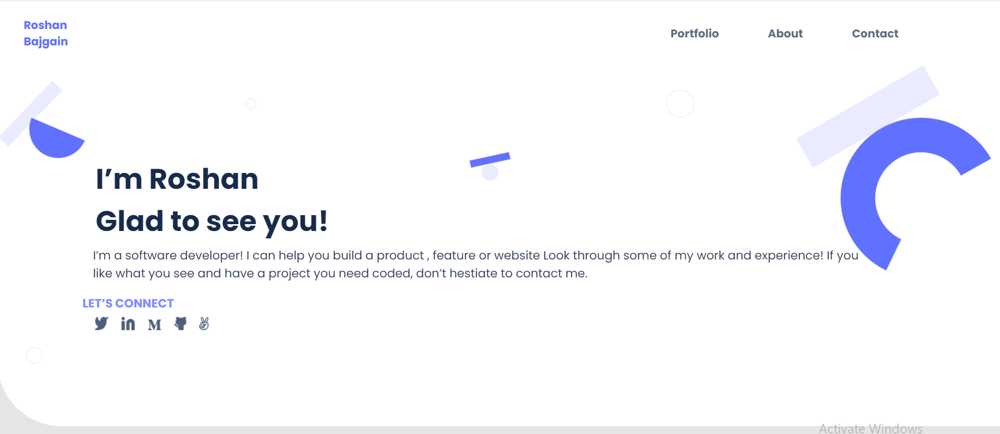
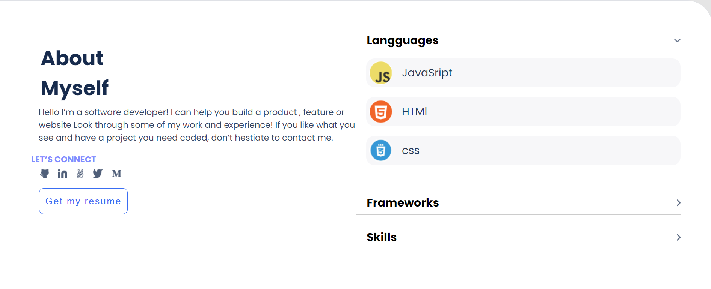
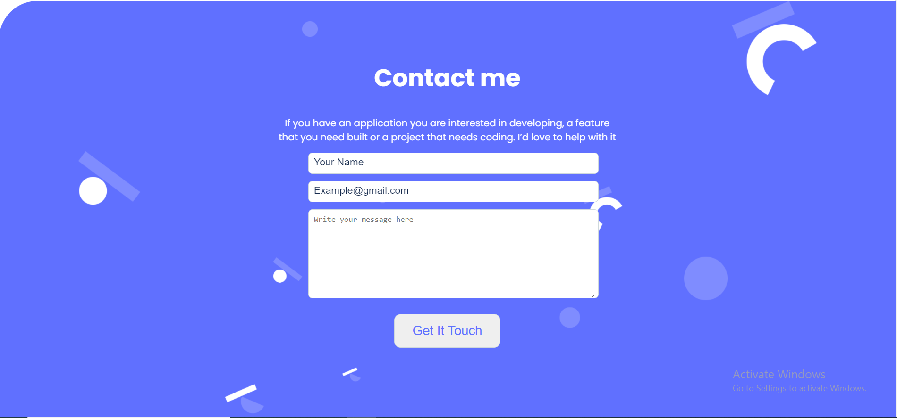

# My-portfolio

# My-portfolio

## Built With

- HTML
- Css
- Javascript

## Live Demo

[Live Demo Link](https://roshan-bajgain.github.io/)

## Getting Started

To get a local copy up and running follow these simple example steps.
1) Enter `git clone git@github.com:roshan-bajgain/My-portfolio.git` into terminal
2) Open in browser to view site

### Prerequisites
-code editor

## Authors

👤 **Roshan Bajgain**

- GitHub: [@roshan-bajgain](https://github.com/roshan-bajgain)
- Twitter: [@RoshanBajgain10](https://twitter.com/RoshanBajgain10)
- LinkedIn: [LinkedIn](https://www.linkedin.com/in/roshan-bazgain/)

## 🤝 Contributing

Contributions, issues, and feature requests are welcome!

## Show your support

Give a ⭐️ if you like this project!

## Acknowledgments

- Hat tip to anyone whose code was used
- Inspiration
- etc
